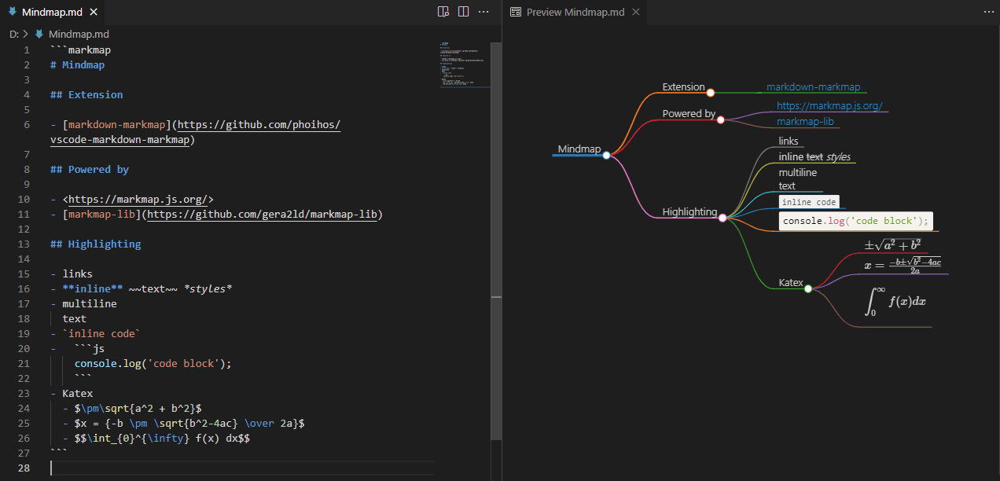
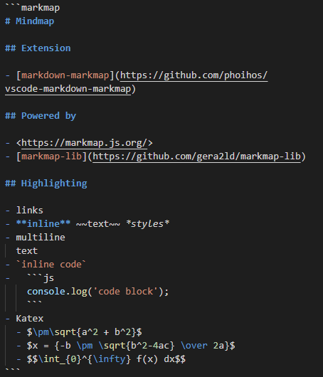

# Markdown Preview Markmap Support

Visualize Markdown as Mindmap (A.K.A Markmap) to VSCode's built-in markdown preview.



## Features

- Syntax highlighting support to `markmap` fenced code block
    - See below a [demo](#syntax-highlighting)
- Attributes support to `markmap` fenced code block
    - See below [details](#attributes)
- Preview support to built-in markdown preview

## Installation

To install this extension go to `View->Extensions` and search for `markdown-markmap`. Next click Install.

## Usage

Create mindmap in markdown using `markmap` (or `mdmm` or `mmmd`) fenced code blocks:

~~~markdown
```markmap {scale=1.1}
# Mindmap

## Extension

- [markdown-markmap](https://github.com/phoihos/vscode-markdown-markmap)

## Powered by

- <https://markmap.js.org/>
- [markmap-lib](https://github.com/gera2ld/markmap-lib)

## Highlighting

- links
- **inline** ~~text~~ *styles*
- multiline
  text
- `inline code`
-   ```js
    console.log('code block');
    ```
- MathJax - $x = {-b \pm \sqrt{b^2-4ac} \over 2a}$
```
~~~

## Syntax Highlighting

Syntax highlighting support exactly the same as VSCode's `markdown`.



## Attributes

Add attributes to `markmap` fenced code block with `{key=value}` curly brackets:

~~~markdown
```markmap {scale=1.1}
···
```
~~~

Table of available attributes:

| Key   | Default Value | Description                   |
| ----- | ------------- | ----------------------------- |
| scale | `1.1`         | Scale the preview render size |


## Markmap Visualizing

Powered by [gera2ld/markmap-lib](https://github.com/gera2ld/markmap/tree/master/packages/markmap-lib).

## Settings

Currently, there is no settings.

## Issues

If you find any problems using this extension or you want to propose new features to it, feel free to open an issue on [Github](https://github.com/phoihos/vscode-markdown-markmap/issues).

## Release Notes

Detailed Release Notes are available [here](https://github.com/phoihos/vscode-markdown-markmap/blob/master/CHANGELOG.md) or above **Changelog** tab.
